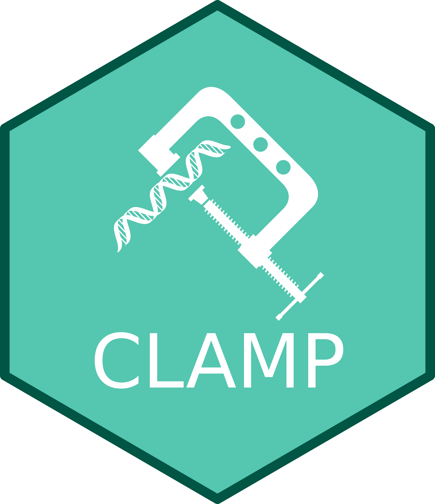

# CLAMP 

<!-- badges: start -->
[](https://github.com/mchikina/mchikina/CLAMP)
[](https://lifecycle.r-lib.org/articles/stages.html#stable)
[](https://github.com/chikinalab/CLAMP/actions/workflows/BiocCheck.yaml)
[](https://github.com/chikinalab/CLAMP/actions/workflows/R-CMD-check.yaml)

<!-- badges: end -->

## Bioconductor release status

|      Branch      |    R CMD check   | Last updated |
|:----------------:|:----------------:|:------------:|
| [_devel_](http://bioconductor.org/packages/devel/bioc/html/CLAMP.html) | [](http://bioconductor.org/checkResults/devel/bioc-LATEST/CLAMP) |  |
| [_release_](http://bioconductor.org/packages/release/bioc/html/CLAMP.html) | [](http://bioconductor.org/checkResults/release/bioc-LATEST/CLAMP) |  |

The goal of CLAMP (**C**urated **L**atent-variable **A**nalysis with **M**olecular **P**riors) is to provide an easy-to-use package to extract interpretable latent variables from large transcriptomic datasets using biological priors.

## Local development via Conda

We keep a fully specified environment file at `envs/clamp.yaml`. From your package root, create and activate it like so:

```bash
# Create and activate the environment
conda env create -f envs/clamp.yaml
conda activate clamp

# Define the repository path (adjust as needed)
REPO_PATH=~/path/to/CLAMP

# Install and check CLAMP using devtools
Rscript -e "devtools::install_local('$REPO_PATH', force=TRUE, dependencies=FALSE)"
Rscript -e "library(CLAMP); cat('CLAMP version:', as.character(packageVersion('CLAMP')), '\n')"
```

## Installation

You can install the latest release of `CLAMP` from Bioconductor:

``` r
if (!requireNamespace("BiocManager", quietly = TRUE)) {
    install.packages("BiocManager")
}

BiocManager::install("CLAMP")
```

If you want to test the development version, you can install it from the github repository:

``` r
BiocManager::install("mchikina/CLAMP")
```

Now you can load the package using:

``` r
library(CLAMP)
```

## Basic usage

For detailed instructions on how to use CLAMP, please see the [vignette](https://mchikina.github.io/CLAMP/articles/CLAMP.html).

``` r
library(CLAMP)
#some example
```

## Code of Conduct

Please note that the CLAMP project is released with a [Contributor
Code of
Conduct](https://contributor-covenant.org/version/2/0/CODE_OF_CONDUCT.html).
By contributing to this project, you agree to abide by its terms.
