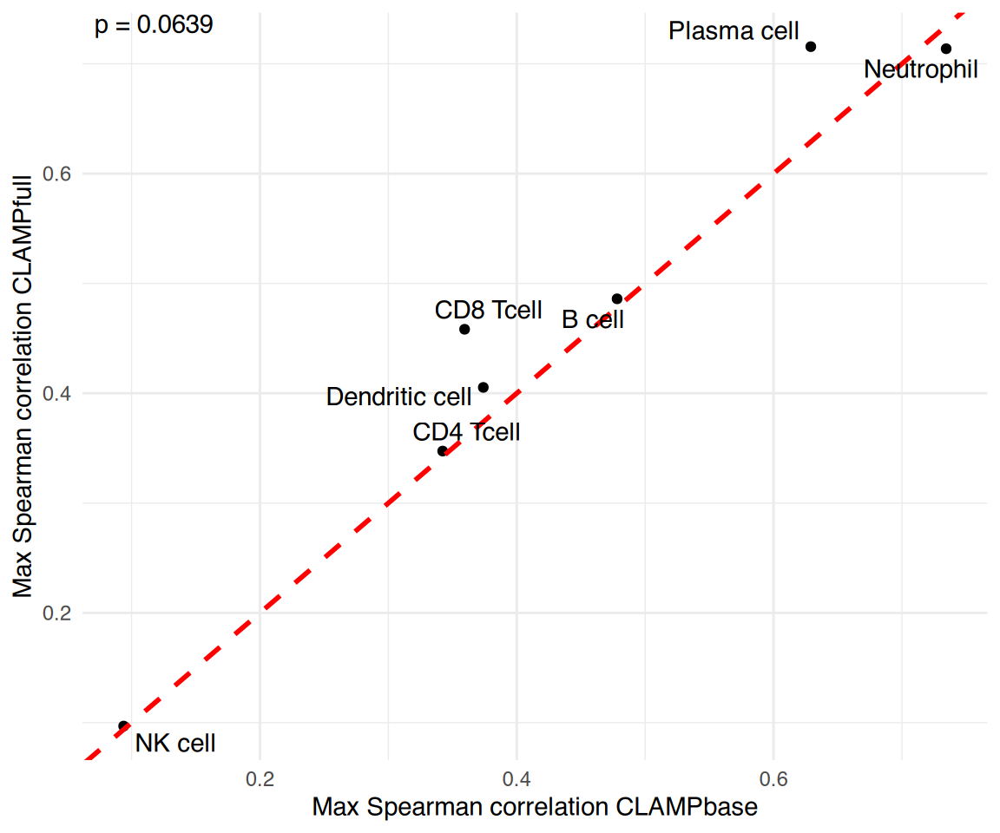
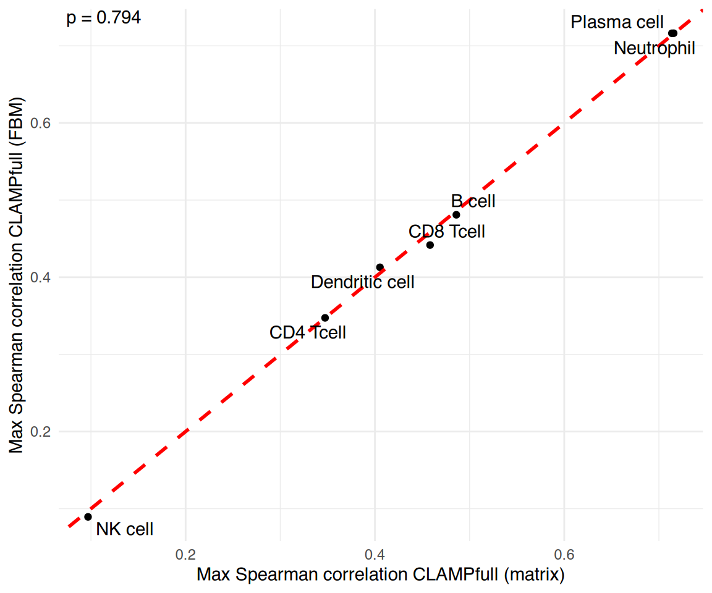

# Comparing CLAMPbase and CLAMPfull

## Overview

This vignette compares the two main models in the **CLAMP** package:

1.  **CLAMPbase**: Unsupervised matrix factorization for dimensionality
    reduction without prior knowledge.
2.  **CLAMPfull**: Pathway-guided refinement that integrates biological
    prior knowledge to improve interpretability.

Using a small human whole blood RNA-Seq dataset, we demonstrate that
incorporating pathway priors in `CLAMPfull` improves the biological
interpretability of latent variables compared to the baseline
`CLAMPbase` model.

We illustrate how to:

- Fit both `CLAMPbase` and `CLAMPfull` models,
- Compare their performance using cell type correlations, and
- Verify that the FBM (Filebacked Big Matrix) implementation produces
  identical results.

### 1. Load Data and Normalize

``` r

data("dataWholeBlood")
data("majorCellTypes")
data("celltypeTargets")

# Scale each gene to mean 0 and variance 1
dataWholeBlood <- tscale(dataWholeBlood)
```

### 2. Load Prior Knowledge Matrices

``` r

# How to download pathway and cell marker libraries from Enrichr.
# Not run during vignette build to avoid network calls; pre-fetched
# .rds files are loaded in the next chunk instead.
enrichr_url <- "https://maayanlab.cloud/Enrichr/geneSetLibrary"
gmtList <- list(
    CellMarkers = getGMT(
        paste0(enrichr_url, "?mode=text&libraryName=CellMarker_2024"),
        "CellMarker_2024"
    ),
    KEGG = getGMT(
        paste0(enrichr_url, "?mode=text&libraryName=KEGG_2021_Human"),
        "KEGG_2021_Human"
    )
)
```

``` r

# Load pre-fetched gene set libraries bundled with the package
gmtList <- list(
    CellMarkers = readRDS(
        system.file("extdata", "CellMarker_2024.rds", package = "CLAMP")
    ),
    KEGG = readRDS(
        system.file("extdata", "KEGG_2021_Human.rds", package = "CLAMP")
    )
)

# Combine into a single sparse matrix
pathMatCell <- gmtListToSparseMat(gmtList)

# Load additional xCell reference matrix
data("xCell")

# Match pathways to the gene space of whole blood
matchedPathsWB <- getMatchedPathwayMatList(
    pathMatCell,
    xCell,
    new.genes = rownames(dataWholeBlood),
    min.genes = 2
)
```

### 3. Compute SVD and Infer k

``` r

set.seed(1)
wb_svd_k <- select_svd_k(dataWholeBlood)
wb_svd <- compute_svd(dataWholeBlood, k = wb_svd_k)
wb_clamp_k <- select_clamp_k(wb_svd,
    n_samples = ncol(dataWholeBlood),
    svd_k = wb_svd_k
)
wb_clamp_k
```

    ## [1] 8

### 4. Fit CLAMPbase and CLAMPfull

``` r

wb_clamp_base <- CLAMPbase(
    dataWholeBlood,
    svdres     = wb_svd,
    clamp_k    = wb_clamp_k,
    trace      = FALSE,
    adaptive.p = 0.05
)
```

``` r

wb_clamp_full <- CLAMPfull(
    dataWholeBlood,
    priorMat          = matchedPathsWB,
    svdres            = wb_svd,
    clamp.base.result = wb_clamp_base,
    clamp_k           = wb_clamp_k,
    trace             = TRUE,
    use_cpp           = TRUE
)
```

### 5. Compare CLAMPbase vs CLAMPfull

This plot compares the maximum Spearman correlation for each major blood
cell type between `CLAMPbase` and `CLAMPfull`.

Points above the red dashed line indicate improved correspondence when
biological priors are included.

Most cell types show higher correlations under `CLAMPfull`,
demonstrating that integrating pathway information helps capture more
biologically meaningful latent variables.

``` r

output <- compareBs(
    wb_clamp_base,
    wb_clamp_full,
    celltypeTargets,
    method = "s",
    xlab   = "CLAMPbase",
    ylab   = "CLAMPfull"
)
```

    ## [1]  8 36
    ## [1]  8 36

``` r

output$plot
```



### 6. Inspect Named Matrix Outputs

`CLAMPbase` and `CLAMPfull` now return `B` (gene loadings, LVs × genes)
and `Z` (sample scores, LVs × samples) as proper named matrices.

``` r

# B: gene loadings (LVs × genes)
dim(wb_clamp_full$B)
```

    ## [1]  8 36

``` r

wb_clamp_full$B[1:3, 1:4]
```

    ##         BD8001    BD8002      BD8003    BD8004
    ## LV1  1.5208805  1.019819  1.52010647  1.723528
    ## LV2 -0.3858266  1.290221 -2.01065989 -2.148343
    ## LV3 -0.7590255 -1.089290 -0.02649019 -3.321543

``` r

# Z: sample scores (LVs × samples)
dim(wb_clamp_full$Z)
```

    ## [1] 11530     8

``` r

wb_clamp_full$Z[1:3, 1:4]
```

    ##          LV1       LV2 LV3 LV4
    ## GAS6       0 0.0000000   0   0
    ## MMP14      0 0.0000000   0   0
    ## MARCKSL1   0 0.3406663   0   0

### 7. Verify FBM Implementation

We verify that `CLAMPfull` produces identical results when using a
file-backed matrix (FBM) input instead of an in-memory matrix. We reuse
the same pre-computed SVD and `clamp_k` so that any differences are
attributable solely to the matrix format, not the randomized SVD.

``` r

dataWholeBloodFBM <- bigstatsr::as_FBM(dataWholeBlood)

wb_clamp_full_fbm <- CLAMPfull(
    dataWholeBloodFBM,
    priorMat          = matchedPathsWB,
    svdres            = wb_svd,
    clamp.base.result = wb_clamp_base,
    clamp_k           = wb_clamp_k,
    trace             = TRUE,
    use_cpp           = TRUE
)
```

The FBM implementation produces identical results:

``` r

output <- compareBs(
    wb_clamp_full,
    wb_clamp_full_fbm,
    celltypeTargets,
    method = "s",
    xlab   = "CLAMPfull (matrix)",
    ylab   = "CLAMPfull (FBM)"
)
```

    ## [1]  8 36
    ## [1]  8 36

``` r

output$plot
```



## Session Information

``` r

sessionInfo()
```

    ## R version 4.6.1 (2026-06-24)
    ## Platform: x86_64-pc-linux-gnu
    ## Running under: Ubuntu 24.04.4 LTS
    ## 
    ## Matrix products: default
    ## BLAS:   /usr/lib/x86_64-linux-gnu/openblas-pthread/libblas.so.3 
    ## LAPACK: /usr/lib/x86_64-linux-gnu/openblas-pthread/libopenblasp-r0.3.26.so;  LAPACK version 3.12.0
    ## 
    ## locale:
    ##  [1] LC_CTYPE=C.UTF-8       LC_NUMERIC=C           LC_TIME=C.UTF-8       
    ##  [4] LC_COLLATE=C.UTF-8     LC_MONETARY=C.UTF-8    LC_MESSAGES=C.UTF-8   
    ##  [7] LC_PAPER=C.UTF-8       LC_NAME=C              LC_ADDRESS=C          
    ## [10] LC_TELEPHONE=C         LC_MEASUREMENT=C.UTF-8 LC_IDENTIFICATION=C   
    ## 
    ## time zone: UTC
    ## tzcode source: system (glibc)
    ## 
    ## attached base packages:
    ## [1] stats     graphics  grDevices utils     datasets  methods   base     
    ## 
    ## other attached packages:
    ## [1] bigstatsr_1.6.2  CLAMP_0.99.5     BiocStyle_2.41.0
    ## 
    ## loaded via a namespace (and not attached):
    ##  [1] gtable_0.3.6          circlize_0.4.18       shape_1.4.6.1        
    ##  [4] rjson_0.2.23          xfun_0.60             bslib_0.12.0         
    ##  [7] ggplot2_4.0.3         htmlwidgets_1.6.4     GlobalOptions_0.1.4  
    ## [10] ggrepel_0.9.8         lattice_0.22-9        bigassertr_0.2.0     
    ## [13] ps_1.9.3              vctrs_0.7.3           tools_4.6.1          
    ## [16] generics_0.1.4        stats4_4.6.1          parallel_4.6.1       
    ## [19] tibble_3.3.1          cluster_2.1.8.2       pkgconfig_2.0.3      
    ## [22] Matrix_1.7-5          RColorBrewer_1.1-3    S7_0.2.2             
    ## [25] desc_1.4.3            S4Vectors_0.51.6      lifecycle_1.0.5      
    ## [28] compiler_4.6.1        farver_2.1.2          textshaping_1.0.5    
    ## [31] bigparallelr_0.3.2    codetools_0.2-20      ComplexHeatmap_2.29.0
    ## [34] clue_0.3-68           htmltools_0.5.9       sass_0.4.10          
    ## [37] yaml_2.3.12           glmnet_5.0            pkgdown_2.2.1        
    ## [40] pillar_1.11.1         crayon_1.5.3          jquerylib_0.1.4      
    ## [43] cachem_1.1.0          iterators_1.0.14      foreach_1.5.2        
    ## [46] rsvd_1.0.5            tidyselect_1.2.1      digest_0.6.39        
    ## [49] dplyr_1.2.1           bookdown_0.47         labeling_0.4.3       
    ## [52] splines_4.6.1         cowplot_1.2.0         fastmap_1.2.0        
    ## [55] grid_4.6.1            colorspace_2.1-3      cli_3.6.6            
    ## [58] magrittr_2.0.5        survival_3.8-6        withr_3.0.3          
    ## [61] scales_1.4.0          rmarkdown_2.31        matrixStats_1.5.0    
    ## [64] rmio_0.4.0            bit_4.6.0             otel_0.2.0           
    ## [67] ragg_1.5.2            png_0.1-9             GetoptLong_1.1.1     
    ## [70] evaluate_1.0.5        ff_4.5.3              knitr_1.51           
    ## [73] IRanges_2.47.2        doParallel_1.0.17     irlba_2.3.7          
    ## [76] rlang_1.3.0           Rcpp_1.1.2            glue_1.8.1           
    ## [79] BiocManager_1.30.27   BiocGenerics_0.59.12  jsonlite_2.0.0       
    ## [82] R6_2.6.1              systemfonts_1.3.2     fs_2.1.0             
    ## [85] flock_0.7
