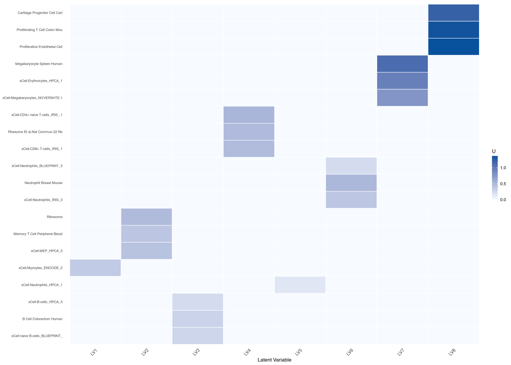
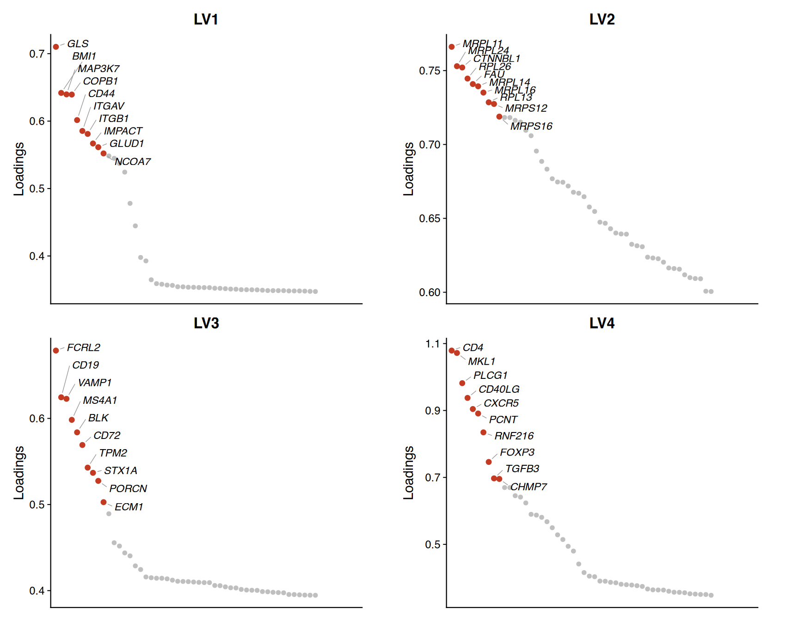
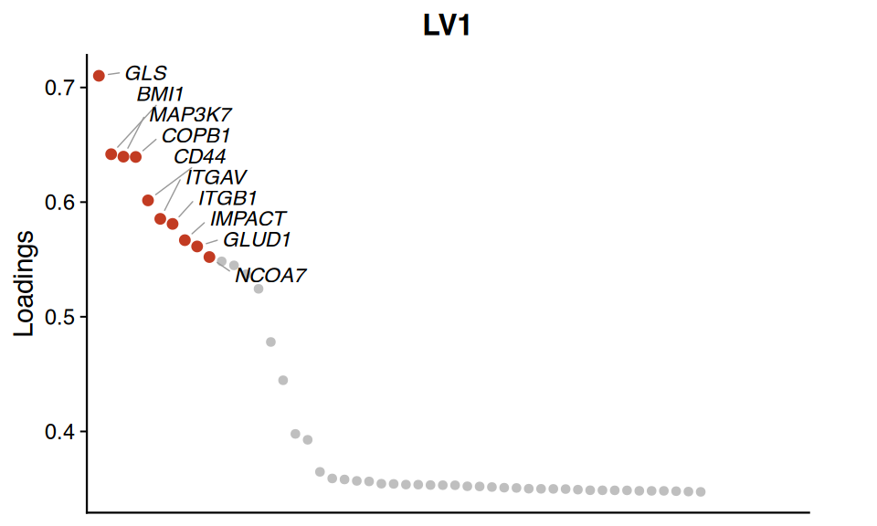
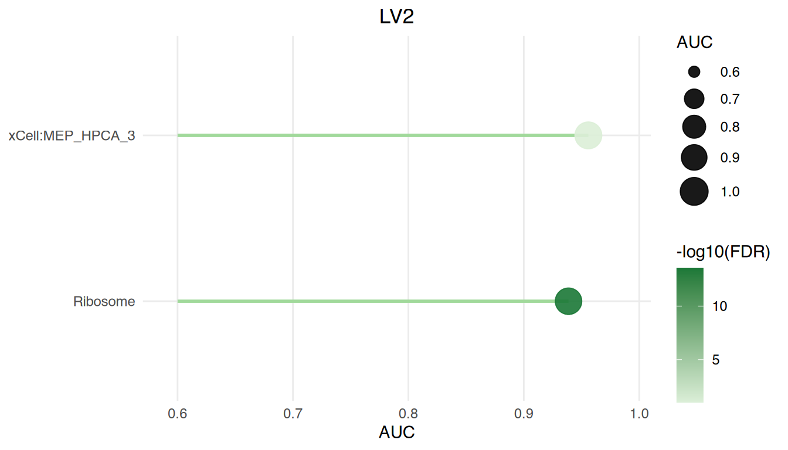
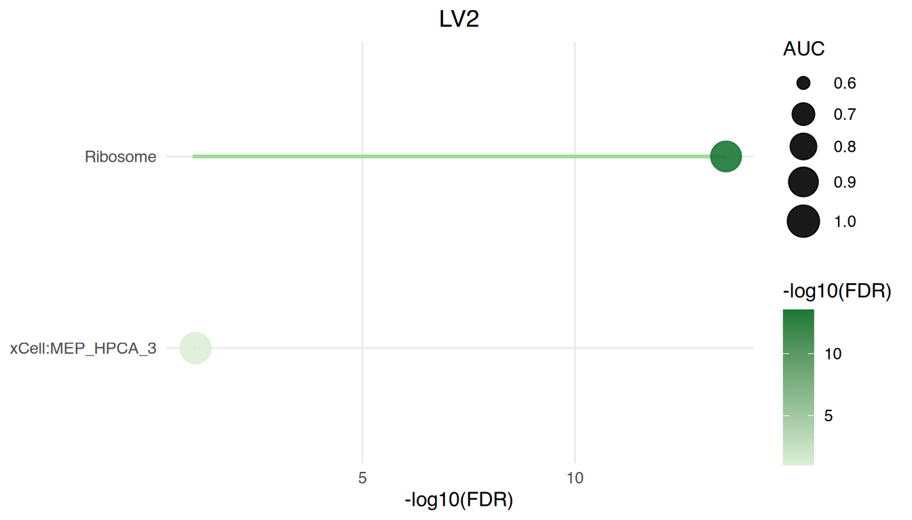
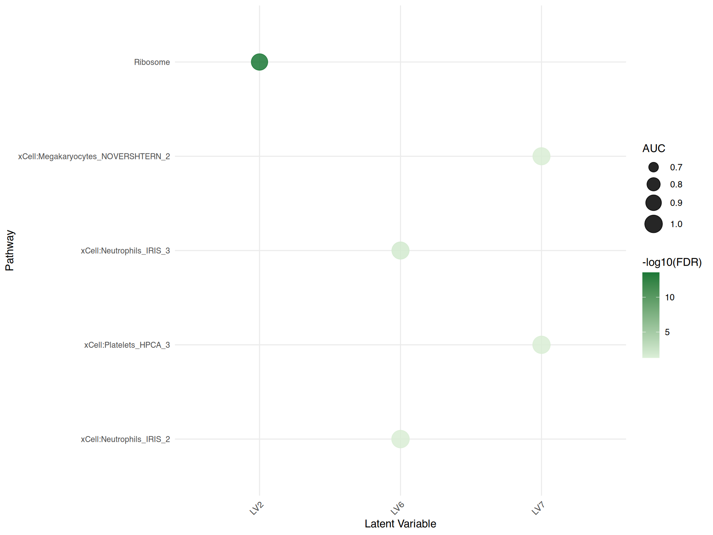

# Analyzing human RNA-Seq data with CLAMP


## Introduction

The CLAMP (**C**urated **L**atent-variable **A**nalysis with
**M**olecular **P**riors) package provides a two-stage framework to
extract interpretable latent variables from high-dimensional
transcriptomic data. It combines a standard matrix decomposition
(**CLAMPbase**) with pathway-guided factor refinement (**CLAMPfull**),
enabling:

1.  **Dimensionality reduction** of gene expression matrices\
2.  **Incorporation of prior knowledge** (e.g., Gene Ontology or
    MSigDB)\
3.  **Adaptive regularization** of gene weights based on their agreement
    with pathway priors\
4.  **Cross-validation** to select robust latent variables

In CLAMPfull, pathway information is integrated through an adaptive
**variance prior** that dynamically modulates the contribution of each
gene according to how well its latent signal aligns with pathway
predictions. This mechanism allows CLAMP to emphasize biologically
consistent genes while maintaining flexibility to discover novel,
data-driven components.\
By combining prior-guided regularization with scalable matrix updates,
CLAMPfull produces interpretable latent variables that capture both
known and emergent biological processes across large transcriptomic
datasets.

### Workflow overview

## Quick Start

We provide three examples:

1.  **Data-frame example (whole blood):**\
    A small dataset loaded entirely into memory. Shows basic
    preprocessing, z-scoring, and running CLAMP without on-disk storage.

2.  **HDF5 example (Alzheimer’s brain):**\
    Demonstrates how to import expression from an HDF5 file, create a
    file-backed FBM object, and process larger datasets using the FBM
    interface.

3.  **Table example (pancreatic islets):**\
    Illustrates reading a tab-delimited count file and comparing
    conditions via the B matrix.

Each example follows these steps:

1.  **Load & preprocess data** (filter by mean/variance, then z-score).
2.  **Compute SVD** and **infer the model dimension `k`**.
3.  **Prepare pathway annotations** via
    [`getGMT()`](https://chikinalab.github.io/CLAMP/reference/getGMT.md)
    and construct the prior matrix.
4.  **Run CLAMPbase** with the pre-computed SVD result and `k` to
    initialize the latent variables.
5.  **Run CLAMPfull** to refine latent variables using pathway priors
    and variance-adaptive regularization, producing the final model and
    summary statistics.

### Computing the SVD and inferring k

CLAMP requires a truncated Singular Value Decomposition (SVD) of the
z-scored expression matrix as input. The choice of SVD function depends
on dataset size:

- **Small to medium datasets (in-memory):** Use
  [`rsvd::rsvd()`](https://rdrr.io/pkg/rsvd/man/rsvd.html) from the
  **rsvd** package. This is efficient for matrices that fit comfortably
  in RAM.

- **Large datasets (file-backed):** Use
  [`bigstatsr::big_randomSVD()`](https://privefl.github.io/bigstatsr/reference/big_randomSVD.html)
  for file-backed matrices (FBM). This function computes the SVD without
  loading the entire matrix into memory, enabling analysis of datasets
  too large for RAM.

After computing the SVD, infer the optimal number of latent variables
(`clamp_k`) using
[`num.pc()`](https://chikinalab.github.io/CLAMP/reference/num.pc.md):

## Example 1: In-memory data.frame (Whole Blood)

### Load example data

In this chunk, we load the whole-blood expression matrix.

``` r

data("dataWholeBlood") # expression matrix
dim(dataWholeBlood) # genes x samples
#> [1] 11530    36
head(dataWholeBlood) # genes x samples
#>             BD8001    BD8002    BD8003    BD8004    BD8005    BD8006    BD8007
#> GAS6      7.123563  7.846633  8.356313  7.387916  7.859675  7.057541  8.960098
#> MMP14     6.636157  7.523565  7.033673  6.895476  6.860524  7.268107  7.121380
#> MARCKSL1 10.632837 11.208832 10.519870 10.804867 10.940891 10.984602 11.258157
#> SPARC    12.206811 11.462327 12.391210 12.457026 12.036049 12.010138 11.342475
#> CTSD     13.147963 13.218464 12.574546 12.710222 13.151780 13.131948 13.466095
#> EPAS1     7.011590  6.196898  6.621782  7.251964  6.792337  6.813567  6.785256
#>             BD8008    BD8009    BD8010    BD8011    BD8012    BD8013    BD8015
#> GAS6      8.120199  7.061915  7.467680  7.593766  7.980510  7.608529  7.524665
#> MMP14     7.196859  6.764261  7.788809  6.925929  6.658480  7.035367  7.105207
#> MARCKSL1 10.943532 11.242130 11.001261 11.094241 10.827391 10.850013 11.201983
#> SPARC    10.979392 12.464739 11.297043 11.613255 12.116145 12.598474 12.364565
#> CTSD     13.326034 12.885950 13.818859 13.065856 12.869455 12.964527 13.407112
#> EPAS1     6.434220  6.310941  5.269084  6.223021  6.383971  5.728530  6.633363
#>             BD8017    BD8018    BD8019    BD8020    BD8021    BD8024    BD8025
#> GAS6      7.939325  8.391950  7.950956  7.560154  7.852542  8.388111  8.465422
#> MMP14     6.905814  7.408872  6.958392  7.166190  6.294972  7.360992  7.649716
#> MARCKSL1 11.088379 11.074874 10.699760 10.778236 11.107787 11.249868 11.004432
#> SPARC    11.935750 12.469152 11.950393 11.285404 12.836662 12.553092 11.980064
#> CTSD     13.669278 13.345946 13.097458 12.637596 13.481647 13.920715 13.477684
#> EPAS1     7.215680  6.401987  6.834593  6.820674  6.909808  6.242905  6.770166
#>             BD8026    BD8027    BD8028    BD8029    BD8030    BD8031    BD8032
#> GAS6      7.924237  7.438211  7.562134  7.941111  7.476552  7.837566  7.576831
#> MMP14     7.265736  6.875840  7.166484  7.365906  7.163581  7.026309  6.822608
#> MARCKSL1 10.861711 10.859864 10.908438 10.817281 10.879364 10.540350 11.192079
#> SPARC    11.762774 11.171782 12.461855 11.742365 13.040843 10.445423 11.940918
#> CTSD     13.034718 12.819660 12.713603 12.618206 12.903100 12.837019 13.388076
#> EPAS1     6.792149  6.321837  7.195378  6.219153  6.971319  7.149990  6.572446
#>             BD8033    BD8034    BD8038    BD8041    BD8042    BD8043    BD8044
#> GAS6      7.589572  7.751689  7.764586  7.526250  7.144113  7.874906  7.362536
#> MMP14     7.197420  7.060375  6.712708  6.758632  6.506008  7.371407  7.299790
#> MARCKSL1 10.913452 10.910316 10.731734 10.960063 10.852984 10.863946 11.093211
#> SPARC    12.454682 11.457722 11.688371 11.563955 12.331355 11.409792 11.690587
#> CTSD     12.851351 12.840063 12.448499 13.271724 12.993058 13.506943 13.312904
#> EPAS1     6.573068  5.614770  7.084063  5.418134  6.325518  6.446405  6.739370
#>             BD8045
#> GAS6      8.315021
#> MMP14     7.354577
#> MARCKSL1 11.404975
#> SPARC    12.448106
#> CTSD     14.070121
#> EPAS1     6.382976
```

### Preprocess and z-score

We first CPM-normalize the data (when needed), filter for genes with
mean expression ≥ 0.5 and variance ≥ 0.1, and then apply z-score
normalization.

``` r

#  CPM normalization
dataWholeBlood_cpm <- cpmCLAMP(dataWholeBlood)

# Filter and compute row statistics
prep_wb <- preprocessCLAMP(
    Y = dataWholeBlood_cpm,
    mean_cutoff = 0.5,
    var_cutoff = 0.1
)

# Extract filtered matrix and rowStats
wb_Y_filtered <- prep_wb$Y_filtered
wb_rowStats <- prep_wb$rowStats


# Z-score normalization
wb_Y_z <- zscoreCLAMP(
    Y_filtered = wb_Y_filtered,
    rowStats = wb_rowStats
)
```

### Compute SVD and infer k

We compute the SVD using
[`select_svd_k()`](https://chikinalab.github.io/CLAMP/reference/select_svd_k.md)
and
[`compute_svd()`](https://chikinalab.github.io/CLAMP/reference/compute_svd.md),
then select `clamp_k` with
[`select_clamp_k()`](https://chikinalab.github.io/CLAMP/reference/select_clamp_k.md).

``` r

# Select SVD rank and compute SVD
wb_svd_k   <- select_svd_k(wb_Y_z)
wb_svd     <- compute_svd(wb_Y_z, k = wb_svd_k)

# Select clamp_k (elbow method by default)
wb_clamp_k <- select_clamp_k(wb_svd, n_samples = ncol(wb_Y_z), svd_k = wb_svd_k)
wb_clamp_k
#> [1] 8
```

### CLAMPbase initialization

We initialize latent variables using `CLAMPbase`, providing the
pre-computed SVD and inferred `k`.

The argument `adaptive.p` defines the percentile used to determine the
adaptive sparsity threshold applied to each latent variable’s gene
loadings. During alternating updates, negative entries in `Z` are
treated as noise, and CLAMP estimates a cutoff based on the `adaptive.p`
quantile of these negative values. All genes with loadings below this
cutoff are set to zero.

This produces **data-driven sparsity**, automatically filtering weak or
noisy signals while retaining genes with the strongest positive
contributions. Lower values of `adaptive.p` (e.g., 0.01) result in
stronger sparsity, while higher values (e.g., 0.1) retain more genes.
The default `adaptive.p = 0.05` typically yields interpretable,
well-separated latent variables in large transcriptomic datasets.

``` r

wb_baseRes <- CLAMPbase(
    Y = wb_Y_z,
    svdres = wb_svd,
    clamp_k = wb_clamp_k
)
```

### Prepare pathway priors

Next, we build a prior matrix from curated gene sets and compute the
Chat object for `CLAMPfull`.

``` r

# How to download pathway and cell marker libraries from Enrichr.
# Not run during vignette build to avoid network calls; pre-fetched
# .rds files are loaded in the next chunk instead.
enrichr_url <- "https://maayanlab.cloud/Enrichr/geneSetLibrary"
gmtList <- list(
    CellMarkers = getGMT(
        paste0(enrichr_url, "?mode=text&libraryName=CellMarker_2024"),
        "CellMarker_2024"
    ),
    KEGG = getGMT(
        paste0(enrichr_url, "?mode=text&libraryName=KEGG_2021_Human"),
        "KEGG_2021_Human"
    )
)
```

``` r

# Load pre-fetched gene set libraries bundled with the package
gmtList <- list(
    CellMarkers = readRDS(
        system.file("extdata", "CellMarker_2024.rds", package = "CLAMP")
    ),
    KEGG = readRDS(
        system.file("extdata", "KEGG_2021_Human.rds", package = "CLAMP")
    )
)

# Combine into a single sparse matrix
pathMatCell <- gmtListToSparseMat(gmtList)

# Load additional xCell reference matrix
data("xCell")

# Match pathways to the gene space of whole blood
matchedPathsWB <- getMatchedPathwayMatList(
    pathMatCell, xCell,
    new.genes = rownames(dataWholeBlood),
    min.genes = 2
)
```

**Note**: GMT files can also be loaded from local storage using
[`read_gmt()`](https://chikinalab.github.io/CLAMP/reference/read_gmt.md).
This allows you to integrate custom or curated gene set libraries, such
as *MSigDB* canonical pathways, directly into your analysis pipeline
alongside remote resources.

### CLAMPfull

Finally, we refine the base model by integrating pathway priors using
`CLAMPfull`, which applies cross-validation to optimize latent variable
regularization. In this new version, `CLAMPfull` incorporates **variable
priors** that adjust the influence of each pathway adaptively, improving
convergence and stability across heterogeneous datasets.

``` r

wb_fullRes <- CLAMPfull(
    wb_Y_z,
    priorMat = matchedPathsWB,
    clamp.base.result = wb_baseRes,
    svdres = wb_svd,
    clamp_k = wb_clamp_k,
    use_cpp = TRUE
)
```

### Display significant latent variables

``` r

# Display significant latent variables
wb_summary_df <- as.data.frame(wb_fullRes$summary) %>%
    dplyr::filter(FDR < 0.05 & AUC > 0.7) %>%
    dplyr::arrange(FDR) %>%
    dplyr::select(LV, pathway, FDR, AUC)

datatable(
    wb_summary_df,
    filter = "top",
    options = list(
        pageLength = 10,
        autoWidth  = TRUE
    ),
    rownames = FALSE,
    class = "stripe hover compact"
) %>%
    formatSignif(c("AUC", "FDR"), 3)
```

## Example 2: File-Backed Matrix (Alzheimer’s Brain)

This example uses data from Alzheimer’s brain samples from a
*Neurobiology of Disease* study (Barbash et al., 2017; DOI:
<https://doi.org/10.1016/j.nbd.2017.06.008>). It demonstrates the
on‑disk workflow with a file‑backed FBM to handle large‑scale
transcriptomic datasets.

### Cleanup old FBM files

``` r

output_dir <- here("output", "alzFBM")
fbm_base <- file.path(output_dir, "FBMalz")
bk_paths <- paste0(fbm_base, c(".bk", "_preproc.bk", "_preproc_filtered.bk"))
file.remove(bk_paths[file.exists(bk_paths)])
#> logical(0)
```

#### Computing CPM on a File-Backed Matrix (FBM)

For file-backed matrices (FBMs), you can compute counts-per-million
(CPM) in-place—without loading the entire dataset into RAM—using the
[`cpmCLAMPFBM()`](https://chikinalab.github.io/CLAMP/reference/cpmCLAMPFBM.md)
function from **CLAMP**:

### Load HDF5 expression

``` r

alz_path <- human_gene_v2_5_alz_h5()
h5 <- H5File$new(alz_path, mode = "r")
expr_mat <- t(h5[["data/expression"]]$read())
genes <- h5[["meta/genes/symbol"]]$read()
samples <- h5[["meta/samples/geo_accession"]]$read()
h5$close_all()
colnames(expr_mat) <- samples
rownames(expr_mat) <- genes
```

### Construct file‑backed FBM

``` r

dir.create(output_dir, recursive = TRUE, showWarnings = FALSE)
alzFBM <- FBM(
    nrow = nrow(expr_mat), ncol = ncol(expr_mat),
    backingfile = fbm_base
)
blk <- 1000

for (i in seq_len(ceiling(nrow(expr_mat) / blk))) {
    rows <- ((i - 1) * blk + 1):min(i * blk, nrow(expr_mat))
    alzFBM[rows, ] <- expr_mat[rows, , drop = FALSE]
}
```

### CPM, preprocess and z‑score FBM

``` r

prep_alz <- preprocessCLAMPFBM(
    fbm = alzFBM,
    mean_cutoff = 0.5,
    var_cutoff = 0.1
)

alz_fbm_filt <- prep_alz$fbm_filtered
alz_rowStats <- prep_alz$rowStats
zscoreCLAMPFBM(alz_fbm_filt, alz_rowStats)
alz_genes <- genes[prep_alz$kept_rows]
```

### Compute SVD and infer k

For file-backed matrices,
[`compute_svd()`](https://chikinalab.github.io/CLAMP/reference/compute_svd.md)
dispatches to
[`bigstatsr::big_SVD()`](https://privefl.github.io/bigstatsr/reference/big_SVD.html)
automatically, avoiding loading the entire matrix into RAM.

``` r

# Select SVD rank and compute SVD (dispatches to bigstatsr for FBM)
alz_svd_k   <- select_svd_k(alz_fbm_filt)
alz_svd     <- compute_svd(alz_fbm_filt, k = alz_svd_k)

# Select clamp_k (elbow method by default)
alz_clamp_k <- select_clamp_k(alz_svd, n_samples = ncol(alz_fbm_filt),
                              svd_k = alz_svd_k)
alz_clamp_k
#> [1] 13
```

### CLAMPbase

``` r

alz_baseRes <- CLAMPbase(
    Y = alz_fbm_filt,
    svdres = alz_svd,
    clamp_k = alz_clamp_k
)
```

### Prepare pathway priors

``` r

alz_gmtList <- list(
    GTEx_Tissues = getGMT("https://maayanlab.cloud/Enrichr/geneSetLibrary?mode=text&libraryName=GTEx_Tissues_V8_2023"),
    BP = getGMT("https://maayanlab.cloud/Enrichr/geneSetLibrary?mode=text&libraryName=GO_Biological_Process_2025"),
    MSigDB = getGMT("https://maayanlab.cloud/Enrichr/geneSetLibrary?mode=text&libraryName=MSigDB_Hallmark_2020")
)

alz_pathMat <- gmtListToSparseMat(alz_gmtList)
alz_matched <- getMatchedPathwayMat(alz_pathMat, alz_genes)
```

### CLAMPfull

``` r

alz_fullRes <- CLAMPfull(
    alz_fbm_filt,
    priorMat = alz_matched,
    clamp.base.result = alz_baseRes,
    svdres = alz_svd,
    clamp_k = alz_clamp_k,
    use_cpp = TRUE
)
```

### Display significant latent variables

``` r

alz_summary_df <- as.data.frame(alz_fullRes$summary) %>%
    dplyr::filter(FDR < 0.05 & AUC > 0.7) %>%
    dplyr::arrange(FDR) %>%
    dplyr::select(LV, pathway, FDR, AUC)

datatable(
    alz_summary_df,
    filter = "top",
    options = list(
        pageLength = 10,
        autoWidth  = TRUE
    ),
    rownames = FALSE,
    class = "stripe hover compact"
) %>%
    formatSignif(c("AUC", "FDR"), 3)
```

## Example 3: Tab-Delimited Count File (Pancreatic Islets)

In this example, we apply the in‑memory CLAMP workflow to RNA‑Seq count
data from GEO accession **GSE164416** (Wigger *et al.* 2021;
“Multi‑omics profiling of living human pancreatic islet donors reveals
heterogeneous beta-cell trajectories towards type 2 diabetes”, DOI:
10.1038/s42255-021-00420-9). After preprocessing the raw counts and
fitting the CLAMP model, we perform a differential analysis of
latent‑variable activities to compare non‑diabetic (ND) and type 2
diabetic (T2D) samples.

### Load count data and map gene symbols

``` r

islet_file <- GSE164416_DP_htseq_counts_txt_gz()
islet_df <- read.table(
    gzfile(islet_file),
    header = TRUE, stringsAsFactors = FALSE
)

islet_df$symbol <- mapIds(org.Hs.eg.db,
    keys = islet_df$ensembl,
    column = "SYMBOL",
    keytype = "ENSEMBL",
    multiVals = "first"
)

islet_df <- islet_df[!is.na(islet_df$symbol), ]
```

### Aggregate counts by gene symbol

``` r

# Sum counts per symbol
setDT(islet_df)
num_cols <- names(islet_df)[sapply(islet_df, is.numeric)]
expr <- islet_df[, lapply(.SD, sum), by = symbol, .SDcols = num_cols]
expr <- as.data.frame(expr)
rownames(expr) <- expr$symbol
expr$symbol <- NULL
expr <- as.matrix(expr)
```

### CPM, preprocess and z-score

``` r

prep_is <- preprocessCLAMP(
    Y = expr,
    mean_cutoff = 0.5,
    var_cutoff = 0.1
)

iso_Yf <- prep_is$Y_filtered
iso_rowS <- prep_is$rowStats

iso_Yz <- zscoreCLAMP(
    Y_filtered = iso_Yf,
    rowStats = iso_rowS
)
```

### Compute SVD and infer k

``` r

# Select SVD rank and compute SVD
islet_svd_k   <- select_svd_k(iso_Yz)
islet_svd     <- compute_svd(iso_Yz, k = islet_svd_k)

# Select clamp_k (elbow method by default)
islet_clamp_k <- select_clamp_k(islet_svd, n_samples = ncol(iso_Yz),
                                svd_k = islet_svd_k)
islet_clamp_k
#> [1] 22
```

### CLAMPbase

``` r

islet_baseRes <- CLAMPbase(
    Y = iso_Yz,
    svdres = islet_svd,
    clamp_k = islet_clamp_k
)
```

### Prepare pathway priors

``` r

islet_gmtList <- list(
    GTEx_Tissues = getGMT("https://maayanlab.cloud/Enrichr/geneSetLibrary?mode=text&libraryName=GTEx_Tissues_V8_2023"),
    Diabetes_Perturbations = getGMT("https://maayanlab.cloud/Enrichr/geneSetLibrary?mode=text&libraryName=Diabetes_Perturbations_GEO_2022"),
    MSigDB_Hallmark = getGMT("https://maayanlab.cloud/Enrichr/geneSetLibrary?mode=text&libraryName=MSigDB_Hallmark_2020")
)

islet_pathMat <- gmtListToSparseMat(islet_gmtList)
islet_matched <- getMatchedPathwayMat(islet_pathMat, rownames(iso_Yz))
islet_chatObj <- getChat(islet_matched)
```

### CLAMPfull

``` r

islet_fullRes <- CLAMPfull(
    iso_Yz,
    priorMat = islet_matched,
    clamp.base.result = islet_baseRes,
    svdres = islet_svd,
    clamp_k = islet_clamp_k,
    use_cpp = TRUE
)
```

### Display significant latent variables

``` r

islet_summary_df <- as.data.frame(islet_fullRes$summary) %>%
    dplyr::filter(FDR < 0.05 & AUC > 0.7) %>%
    dplyr::arrange(FDR) %>%
    dplyr::select(LV, pathway, FDR, AUC)

datatable(
    islet_summary_df,
    filter = "top",
    options = list(
        pageLength = 10,
        autoWidth  = TRUE
    ),
    rownames = FALSE,
    class = "stripe hover compact"
) %>%
    formatSignif(c("AUC", "FDR"), 3)
```

### Differential latent-variable expression between conditions

Rows of the B matrix correspond to LVs and columns to samples. By
grouping samples by condition (ND vs T2D), we compute average LV
expression per group to identify LVs that differ between healthy and
diabetic islets

``` r

B_df <- as.data.frame(as.matrix(islet_fullRes$B)) %>%
    dplyr::mutate(LV = rownames(.))

islet_meta <- islets_metadata_csv()
iselt_metadata <- read.csv(islet_meta, header = TRUE)

sample_types <- iselt_metadata %>%
    dplyr::mutate(
        id   = as.character(id),
        type = as.character(type)
    )

sample_cols <- setdiff(colnames(B_df), "LV")
nd_cols <- intersect(sample_cols, sample_types$id[sample_types$type == "ND"])
other_cols <- intersect(sample_cols, sample_types$id[sample_types$type != "ND"])

if (length(nd_cols) == 0 || length(other_cols) == 0) {
    stop("No matching ND or non-ND sample columns found")
}

lv_stats_all_vs_nd <- B_df %>%
    dplyr::rowwise() %>%
    dplyr::mutate(
        Mean_ND = mean(dplyr::c_across(dplyr::all_of(nd_cols))),
        Mean_All = mean(dplyr::c_across(dplyr::all_of(other_cols))),
        Mean_Diff = Mean_All - Mean_ND,
        P_Value = stats::wilcox.test(
            dplyr::c_across(dplyr::all_of(nd_cols)),
            dplyr::c_across(dplyr::all_of(other_cols))
        )$p.value
    ) %>%
    dplyr::ungroup() %>%
    dplyr::mutate(FDR = stats::p.adjust(P_Value, method = "fdr")) %>%
    dplyr::select(LV, Mean_ND, Mean_All, Mean_Diff, P_Value, FDR) %>%
    dplyr::arrange(FDR)

sig_lv_all_vs_nd <- lv_stats_all_vs_nd %>%
    dplyr::filter(FDR < 0.1)

sig_pathway <- islet_summary_df %>%
    dplyr::filter(FDR < 0.05 & AUC > 0.7) %>%
    dplyr::filter(LV %in% sig_lv_all_vs_nd$LV) %>%
    dplyr::arrange(FDR) %>%
    dplyr::select(LV, pathway, FDR, AUC)

datatable(
    sig_pathway,
    filter = "top",
    options = list(
        pageLength = 10,
        autoWidth  = TRUE
    ),
    rownames = FALSE,
    class = "stripe hover compact"
) %>%
    formatSignif(c("AUC", "FDR"), 3)
```

## Projection: Applying one CLAMP model to another dataset

[`projectCLAMP()`](https://chikinalab.github.io/CLAMP/reference/projectCLAMP.md)
reuses the gene loadings (**Z**) from a fitted CLAMP model and estimates
latent-variable activities (**B**) for a new expression matrix.
Projection uses the same genes in the same order; when both matrices
have row names,
[`projectCLAMP()`](https://chikinalab.github.io/CLAMP/reference/projectCLAMP.md)
aligns the common genes automatically before solving for **B**.

Here we project the whole-blood expression matrix from Example 1 into
the full latent-variable space learned from the pancreatic islet model
in Example 3.

``` r

islet_model_genes <- rownames(islet_fullRes$Z)
wb_project_genes <- rownames(wb_Y_z)

common_genes <- intersect(islet_model_genes, wb_project_genes)
cat(
    "Overlapping genes:", length(common_genes), "/", length(islet_model_genes),
    "islet model genes",
    sprintf(
        "(%.1f%%)\n",
        100 * length(common_genes) / length(islet_model_genes)
    )
)
#> Overlapping genes: 10574 / 23039 islet model genes (45.9%)

# projectCLAMP aligns common row names in the model's gene order
wb_projected_B <- projectCLAMP(islet_fullRes, wb_Y_z)
#> 10574 common rows found

dim(wb_projected_B)
#> [1] 22 36
wb_projected_B[
    seq_len(min(5, nrow(wb_projected_B))),
    seq_len(min(5, ncol(wb_projected_B))),
    drop = FALSE
]
#>          BD8001      BD8002       BD8003     BD8004        BD8005
#> LV1  1.00463791  1.06252828  0.206834743  0.9462186  0.1405144722
#> LV2  0.06326851  0.02415934 -0.004619301  0.2063914  0.0635217500
#> LV3  0.07038160 -0.05673659 -0.270425260  0.3261250  0.0954014821
#> LV4 -0.78853848 -0.19832272 -0.590660326 -1.2604121 -0.0218641956
#> LV5 -0.05884216 -0.04328334 -0.280842565  0.1427628  0.0008481091
```

## Choosing the Number of Latent Variables (CLAMP_K)

CLAMP_K controls how many latent variables the model learns. Too few and
biologically distinct signals merge; too many and noise is absorbed into
spurious components.
[`select_clamp_k()`](https://chikinalab.github.io/CLAMP/reference/select_clamp_k.md)
is the unified interface: it takes the SVD result, the number of
samples, the SVD truncation rank, and an optional `method` argument, and
returns a list with `$clamp_k` (number of LVs) and `$scale`
(regularization scale used downstream).

### Elbow method (default)

The elbow heuristic fits a smoothing spline to the singular-value scree
plot and returns the index at which curvature is maximised. This is the
fastest option and works well when the signal-to-noise boundary is
clear.

``` r

select_clamp_k(
    wb_svd,
    n_samples = ncol(wb_Y_z),
    svd_k     = wb_svd_k,
    method    = "elbow"
)
#> [1] 8
```

### Permutation method

The permutation approach shuffles each row of the input matrix
independently `B` times and recomputes the SVD to build a null
distribution of singular values. The number of components whose observed
singular value exceeds the 95th percentile of the null is returned. This
is more conservative and slower, but robust to smooth scree plots.

``` r

select_clamp_k(
    wb_svd,
    n_samples = ncol(wb_Y_z),
    svd_k     = wb_svd_k,
    method    = "permutation",
    data      = wb_Y_z,
    B         = 2
)
```

### Gavish–Donoho optimal hard threshold (PCAtools)

The Gavish–Donoho threshold (Gavish & Donoho, 2014) identifies the
singular-value cutoff below which components are statistically
indistinguishable from noise, given matrix dimensions and an estimate of
the noise level. **PCAtools** implements this via
`chooseGavishDonoho()`.

``` r

select_clamp_k(
    wb_svd,
    n_samples = ncol(wb_Y_z),
    svd_k     = wb_svd_k,
    method    = "gavish_donoho",
    data      = wb_Y_z
)
```

## Visualization

CLAMP provides dedicated plotting functions built on **ggplot2**,
prefixed `CLAMPplot` or `CLAMPdotplot`. The examples below use the
whole-blood result `wb_fullRes` computed in Example 1.

### Pathway–LV association heatmap (`CLAMPplotU`)

`CLAMPplotU` displays the pathway loading matrix **U** after filtering
by AUC and FDR. Only the top-`top` pathways per LV are shown, making it
easy to scan which pathways drive each latent variable.

``` r

CLAMPplotU(
    wb_fullRes,
    auc.cutoff = 0.6,
    fdr.cutoff = 0.05,
    top        = 3
)
```



### Top-gene loading plot (`CLAMPplotTopZ`)

`CLAMPplotTopZ` ranks genes by their Z loading for each selected LV and
plots the top genes as loading-versus-rank scatter plots. The
highest-loading genes are labelled directly.

``` r

# Use the first few LVs that have pathway support
lv_with_paths <- wb_fullRes$withPrior[
    seq_len(min(4, length(wb_fullRes$withPrior)))
]

CLAMPplotTopZ(
    wb_fullRes,
    top       = 50,
    label.top = 10,
    index     = lv_with_paths
)
```



Only one LV:

``` r

# Use the first few LVs that have pathway support
lv_with_paths <- wb_fullRes$withPrior[1]

CLAMPplotTopZ(
    wb_fullRes,
    top       = 50,
    label.top = 10,
    index     = lv_with_paths
)
```

 \## Single-LV
pathway dot plot (`CLAMPdotplot`)

`CLAMPdotplot` shows the top pathways for one selected LV as a lollipop
chart. Dot size encodes AUC; dot colour encodes `-log10(FDR)`. Use
`x.axis` and `order.by` to choose whether the x-axis and pathway ranking
use AUC or `-log10(FDR)`.

Plot order by AUC:

``` r

CLAMPdotplot(
    wb_fullRes,
    lv         = "LV2",
    top        = 15,
    auc.cutoff = 0.6,
    fdr.cutoff = 0.1,
    x.axis     = "AUC",
    order.by   = "AUC"
)
```



Plot order by FDR:

``` r

CLAMPdotplot(
    wb_fullRes,
    lv         = "LV2",
    top        = 15,
    auc.cutoff = 0.6,
    fdr.cutoff = 0.1,
    x.axis     = "-log10(FDR)",
    order.by   = "-log10(FDR)"
)
```



### All-LV pathway dot plot (`CLAMPdotplotAll`)

`CLAMPdotplotAll` gives a compact overview of all significant pathway–LV
associations across every latent variable. Dot size encodes AUC and dot
colour encodes `-log10(FDR)`.

``` r

CLAMPdotplotAll(
    wb_fullRes,
    auc.cutoff = 0.65,
    fdr.cutoff = 0.05,
    top.per.lv = 5
)
```



## Parallelization in CLAMP

CLAMP supports multi-core parallelization for computationally intensive
operations, particularly when working with large datasets and
file-backed matrices (FBMs). The `ncores` parameter can be used in
several key functions to speed up processing.

The following CLAMP functions accept an `ncores` parameter:

- [`CLAMPbase()`](https://chikinalab.github.io/CLAMP/reference/CLAMPbase.md)
- [`CLAMPfull()`](https://chikinalab.github.io/CLAMP/reference/CLAMPfull.md)
- [`projectCLAMP()`](https://chikinalab.github.io/CLAMP/reference/projectCLAMP.md)
- [`preprocessCLAMPFBM()`](https://chikinalab.github.io/CLAMP/reference/preprocessCLAMPFBM.md)
- [`zscoreCLAMPFBM()`](https://chikinalab.github.io/CLAMP/reference/zscoreCLAMPFBM.md)
- [`cpmCLAMPFBM()`](https://chikinalab.github.io/CLAMP/reference/cpmCLAMPFBM.md)

## Session Information

``` r

sessionInfo()
#> R version 4.6.0 (2026-04-24)
#> Platform: aarch64-apple-darwin23
#> Running under: macOS Tahoe 26.4
#> 
#> Matrix products: default
#> BLAS:   /Library/Frameworks/R.framework/Versions/4.6/Resources/lib/libRblas.0.dylib 
#> LAPACK: /Library/Frameworks/R.framework/Versions/4.6/Resources/lib/libRlapack.dylib;  LAPACK version 3.12.1
#> 
#> locale:
#> [1] C.UTF-8/C.UTF-8/C.UTF-8/C/C.UTF-8/C.UTF-8
#> 
#> time zone: America/Denver
#> tzcode source: internal
#> 
#> attached base packages:
#> [1] stats4    stats     graphics  grDevices utils     datasets  methods  
#> [8] base     
#> 
#> other attached packages:
#>  [1] DiagrammeR_1.0.12    DT_0.34.0            org.Hs.eg.db_3.23.1 
#>  [4] AnnotationDbi_1.74.0 IRanges_2.46.0       S4Vectors_0.50.0    
#>  [7] Biobase_2.72.0       BiocGenerics_0.58.0  generics_0.1.4      
#> [10] here_1.0.2           bigstatsr_1.6.2      data.table_1.18.2.1 
#> [13] hdf5r_1.3.12         glmnet_5.0           Matrix_1.7-5        
#> [16] rsvd_1.0.5           CLAMPData_0.99.4     CLAMP_0.99.0        
#> [19] dplyr_1.2.1          BiocStyle_2.40.0    
#> 
#> loaded via a namespace (and not attached):
#>   [1] DBI_1.3.0             httr2_1.2.2           rlang_1.2.0          
#>   [4] magrittr_2.0.5        clue_0.3-68           GetoptLong_1.1.1     
#>   [7] otel_0.2.0            matrixStats_1.5.0     compiler_4.6.0       
#>  [10] RSQLite_2.4.6         png_0.1-9             systemfonts_1.3.2    
#>  [13] vctrs_0.7.3           pkgconfig_2.0.3       shape_1.4.6.1        
#>  [16] crayon_1.5.3          fastmap_1.2.0         XVector_0.52.0       
#>  [19] dbplyr_2.5.2          labeling_0.4.3        rmarkdown_2.31       
#>  [22] ps_1.9.3              ragg_1.5.2            purrr_1.2.2          
#>  [25] bit_4.6.0             xfun_0.57             cachem_1.1.0         
#>  [28] rmio_0.4.0            jsonlite_2.0.0        blob_1.3.0           
#>  [31] irlba_2.3.7           parallel_4.6.0        cluster_2.1.8.2      
#>  [34] R6_2.6.1              bslib_0.10.0          RColorBrewer_1.1-3   
#>  [37] jquerylib_0.1.4       Seqinfo_1.2.0         Rcpp_1.1.1-1.1       
#>  [40] bookdown_0.46         iterators_1.0.14      knitr_1.51           
#>  [43] splines_4.6.0         tidyselect_1.2.1      rstudioapi_0.18.0    
#>  [46] yaml_2.3.12           doParallel_1.0.17     codetools_0.2-20     
#>  [49] curl_7.1.0            lattice_0.22-9        tibble_3.3.1         
#>  [52] withr_3.0.2           KEGGREST_1.52.0       S7_0.2.2             
#>  [55] evaluate_1.0.5        desc_1.4.3            survival_3.8-6       
#>  [58] BiocFileCache_3.2.0   circlize_0.4.18       ExperimentHub_3.2.0  
#>  [61] Biostrings_2.80.0     pillar_1.11.1         BiocManager_1.30.27  
#>  [64] filelock_1.0.3        foreach_1.5.2         bigassertr_0.1.7     
#>  [67] rprojroot_2.1.1       BiocVersion_3.23.1    ggplot2_4.0.3        
#>  [70] scales_1.4.0          ff_4.5.2              glue_1.8.1           
#>  [73] tools_4.6.0           AnnotationHub_4.2.0   RSpectra_0.16-2      
#>  [76] visNetwork_2.1.4      fs_2.1.0              cowplot_1.2.0        
#>  [79] grid_4.6.0            crosstalk_1.2.2       colorspace_2.1-2     
#>  [82] patchwork_1.3.2       flock_0.7             cli_3.6.6            
#>  [85] rappdirs_0.3.4        textshaping_1.0.5     bigparallelr_0.3.2   
#>  [88] ComplexHeatmap_2.28.0 gtable_0.3.6          sass_0.4.10          
#>  [91] digest_0.6.39         ggrepel_0.9.8         rjson_0.2.23         
#>  [94] htmlwidgets_1.6.4     farver_2.1.2          memoise_2.0.1        
#>  [97] htmltools_0.5.9       pkgdown_2.2.0         lifecycle_1.0.5      
#> [100] httr_1.4.8            GlobalOptions_0.1.4   bit64_4.8.0
```
